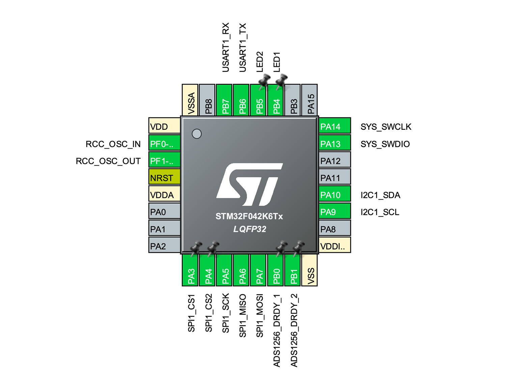
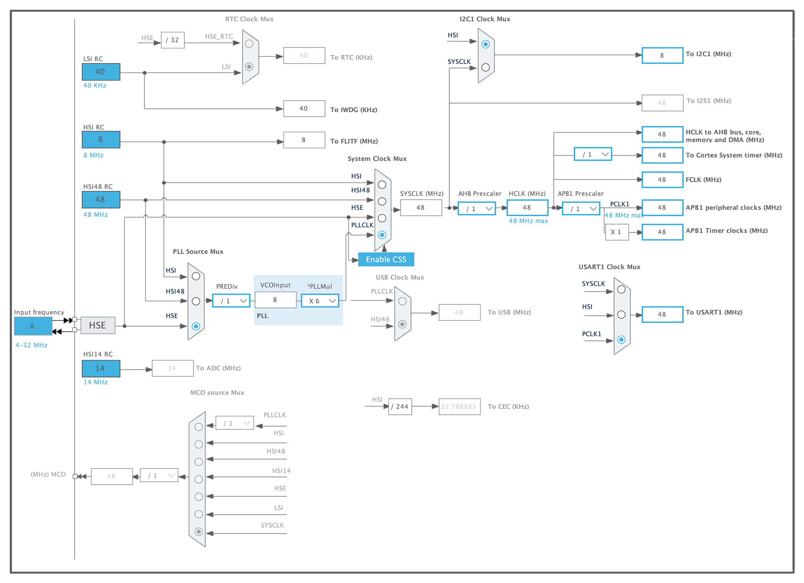

# Firmware

The source code of the firmware is listed [here](https://github.com/doublehan07/DOGlove_Firmware).

## Use the Firmware

You can download the precompiled firmware from the following link and flash it to the STM32:
[DOGlove.hex](https://github.com/doublehan07/DOGlove_Firmware/releases/download/v1.0/DOGlove.hex)

## Build from Source Code

To build the firmware from source:

```bash
git clone https://github.com/doublehan07/DOGlove_Firmware.git
cd DOGlove_Firmware
make
```

> 💡 Note: You may need to install [arm-none-eabi-gcc](https://developer.arm.com/downloads/-/gnu-rm) to compile the firmware.

## Notes for Advanced Developers

To modify the firmware or view pin configurations, open the [DOGlove.ioc](https://github.com/doublehan07/DOGlove_Firmware/blob/main/DOGlove.ioc) file using [STM32CubeMX](https://www.st.com/en/development-tools/stm32cubemx.html).

### Pin Allocation



### Clock Tree Configuration



### Source Code Structure

* [/Core](https://github.com/doublehan07/DOGlove_Firmware/tree/main/Core): *(Auto-generated by STM32CubeMX, except for `main.c` and `stm32f0xx_it.c`)*

  * [main.c](https://github.com/doublehan07/DOGlove_Firmware/blob/main/Core/Src/main.c): System initialization, LRA control, and encoder data packaging.
  * [stm32f0xx\_it.c](https://github.com/doublehan07/DOGlove_Firmware/blob/main/Core/Src/stm32f0xx_it.c): SysTick handler used for system-level scheduling.

* [/Drivers](https://github.com/doublehan07/DOGlove_Firmware/tree/main/Drivers): STM32 HAL drivers *(auto-generated)*

* [/Users](https://github.com/doublehan07/DOGlove_Firmware/tree/main/Users): Custom drivers and application code.

  * [ads1256.c](https://github.com/doublehan07/DOGlove_Firmware/blob/main/Users/ads1256.c): ADC driver for the ADS1256 chip.
  * [drv2605l.c](https://github.com/doublehan07/DOGlove_Firmware/blob/main/Users/drv2605l.c): Haptic driver for the DRV2605L chip.
  * [tca9548a.c](https://github.com/doublehan07/DOGlove_Firmware/blob/main/Users/tca9548a.c): I2C multiplexer driver for the TCA9548A chip.
  * [fsr.c](https://github.com/doublehan07/DOGlove_Firmware/blob/main/Users/fsr.c): Reads power supply voltage via STM32's internal ADC.
  * [delay.c](https://github.com/doublehan07/DOGlove_Firmware/blob/main/Users/delay.c): Implements precise millisecond-level delay.
  * [lra\_control.c](https://github.com/doublehan07/DOGlove_Firmware/blob/main/Users/lra_control.c): LRA control logic and UART RX event callback.
