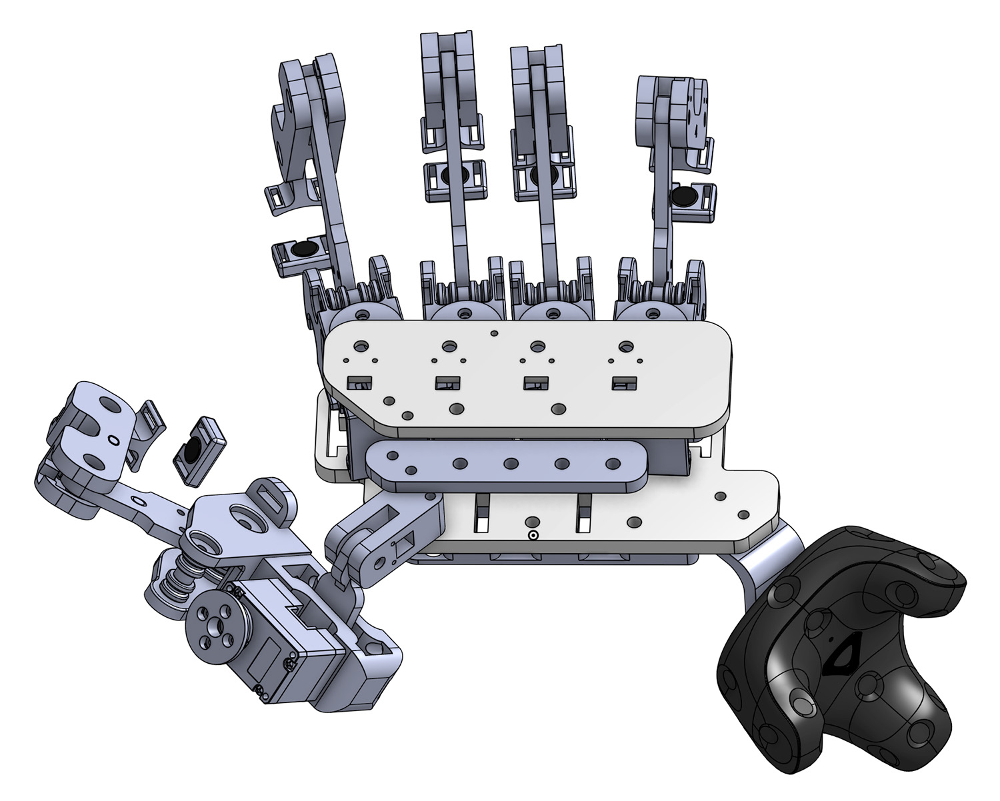

# Mechanical Design

You can view the 3D model of DOGlove on Onshape. The model can be exported to SolidWorks, STEP, IGES, STL, and other formats supported by Onshape.

[🧩 Onshape: 3D Model](https://cad.onshape.com/documents/7fa03943c40f265f7147311f)

