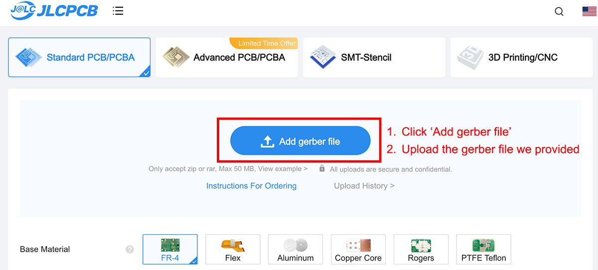
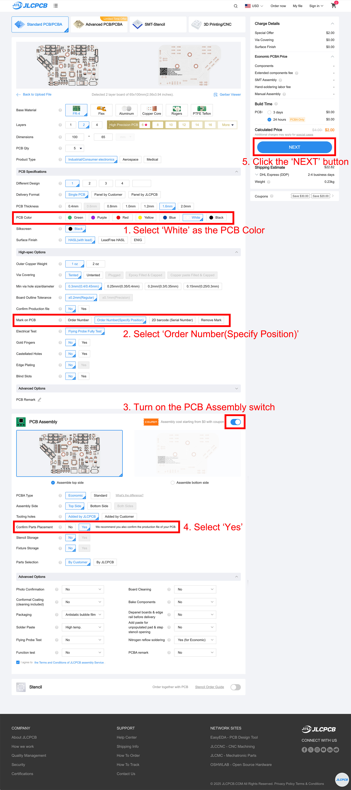
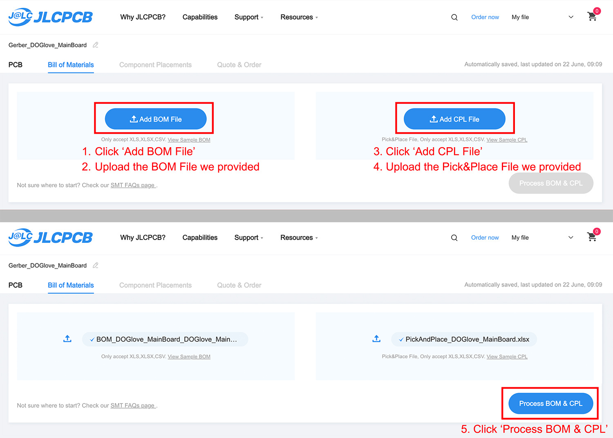
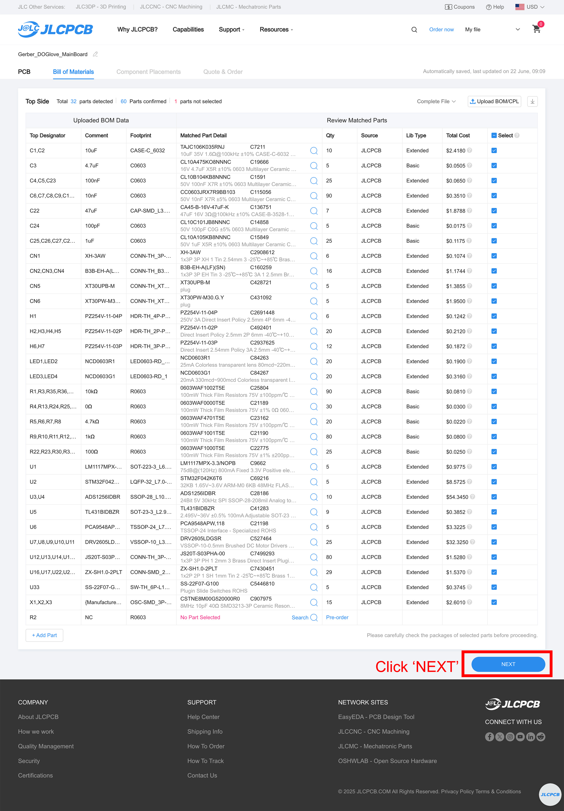
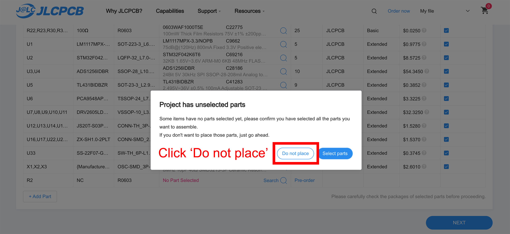
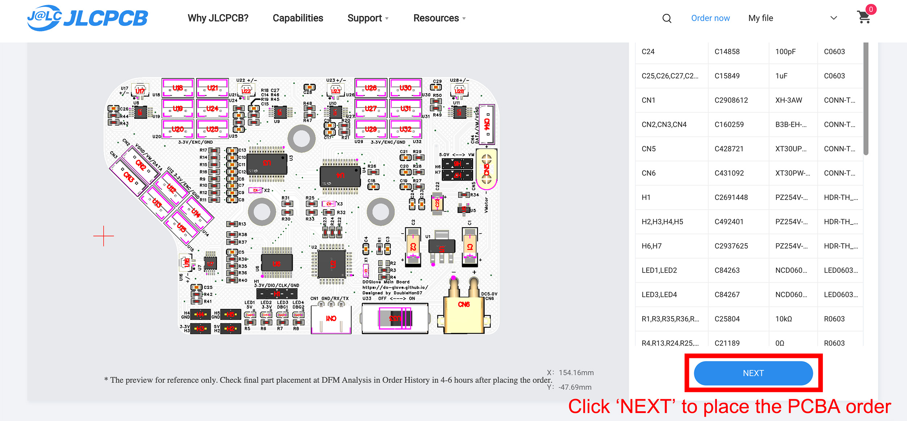

.. _tutorials_en:

=================
PCB Assembly
=================

- `Step-by-step Tutorial (English) <#tutorials_en>`_

Step-by-Step Guide to Ordering PCBA
====================================

This tutorial walks you through how to order the DOGlove main board through `JLCPCB <https://cart.jlcpcb.com/quote>`_.

.. note::
   You're free to choose any PCBA manufacturer you prefer. In general, you'll need to submit a **Gerber file** (for PCB fabrication) and **Pick & Place + BOM files** (for SMT assembly).

1. File Preparation
-------------------

- :download:`Download Gerber file <../_static/quick_start/pcba/Gerber_DOGlove_MainBoard.zip>`
- :download:`Download Pick & Place file <../_static/quick_start/pcba/PickAndPlace_DOGlove_MainBoard.xlsx>`
- :download:`Download BOM file <../_static/quick_start/pcba/BOM_DOGlove_MainBoard_DOGlove_MainBoard.xlsx>`

2. Order the PCB
------------------

**Step 1:** Upload the Gerber file you just downloaded.

**Step 2:** Follow the image tutorial below to select the appropriate manufacturing parameters.

**Step 3:** On the next page, open the ``Bill of Materials`` section and upload both the **BOM** and **Pick & Place** files.

**Step 4:** Once processed, a parts confirmation list will be shown. If all parts are in stock, click **NEXT** to proceed.

.. tip::
   If some parts are unavailable, manually select substitutes using the suggestions provided. 

   Need help? Open a GitHub issue or contact Han directly.

**Step 5:** You might see a warning like *"Project has unselected parts."* This is normal, as some NC (Not Connected) parts are not meant to be assembled. Just click **Do not place** to continue.

**Final Step:** 🎉 You’re almost there! You can now preview a 3D model of your assembled board. If everything looks good and matches the preview images, click **NEXT** to place your order!

