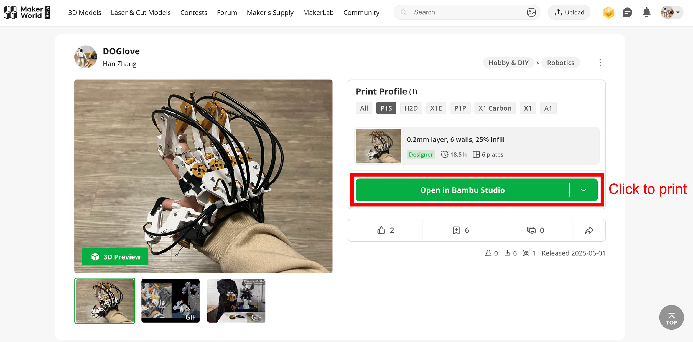

3D Printing Guide
===================

This guide is optimized for the **Bambu P1S Combo (P1SC)** printer using official Bambu filaments.

Materials List
--------------

.. list-table::
   :header-rows: 1
   :widths: 30 10 30 30

   * - Component
     - Quantity
     - Purchase Link
     - Purchase Link (China)
   * - **3D Print Filament**
     - 
     - 
     - 
   * - Bambu PETG Basic (Gold)
     - 1
     - `Bambu PETG Basic Gold <https://us.store.bambulab.com/products/petg-hf?id=42735939649672>`_
     - `Taobao PETG Basic <https://detail.tmall.com/item.htm?id=816799102364>`_
   * - Bambu PETG HF (White)
     - 1
     - `Bambu PETG HF White <https://us.store.bambulab.com/products/petg-hf?id=42735939846280>`_
     - `Taobao PETG HF <https://detail.tmall.com/item.htm?id=816799102364>`_
   * - Bambu Support for PLA/PETG
     - 1
     - `Bambu Support <https://us.store.bambulab.com/products/support-for-pla-petg>`_
     - `Taobao Support <https://detail.tmall.com/item.htm?abbucket=9&id=813808728827>`_
   * - Bambu TPU for AMS (White)
     - 1
     - `Bambu TPU <https://us.store.bambulab.com/products/tpu-for-ams?id=43059884720264>`_
     - `Taobao TPU <https://detail.tmall.com/item.htm?abbucket=9&id=847975695749&skuId=5633828620351>`_

Printing with Bambu Studio
--------------------------

If you're using a Bambu printer:

#. Visit our `MakerWorld model page <https://makerworld.com/en/models/1476400-doglove#profileId-1541008>`_.
#. Click **Open in Bambu Studio**.
#. Match the filament colors with those loaded in your AMS.
#. Start the print.

.. tip::

   We recommend using **Bambu Liquid Glue for Build Plate** to improve first-layer adhesion.

   `Buy here <https://us.store.bambulab.com/products/liquid-glue-for-build-plate>`_, `购买链接 <https://detail.tmall.com/item.htm?abbucket=13&detail_redpacket_pop=true&id=698882119427>`_

.. note::

   Bambu PETG Basic (Gold) may be out of stock.

   You can substitute it with Bambu PETG HF (Yellow) or any other PETG HF color of your choice.

Printing on Non-Bambu Printers
------------------------------

For users of other 3D printers, here are some material and profile suggestions:

- **Joints & Fingers**: PETG

  - Use a strong-print profile: 50% sparse infill, 50% infill/wall overlap, 10 wall loops

- **Palm**: PETG or PLA

  - Use a standard print profile: low infill density and fewer wall loops to reduce weight

- **TPU Components**: Use the softest TPU possible for comfort when contacting the skin

.. note::

   Bambu AMS supports TPU 68D.

   If your printer allows, consider softer filaments like TPU 90A or TPU 85A.
