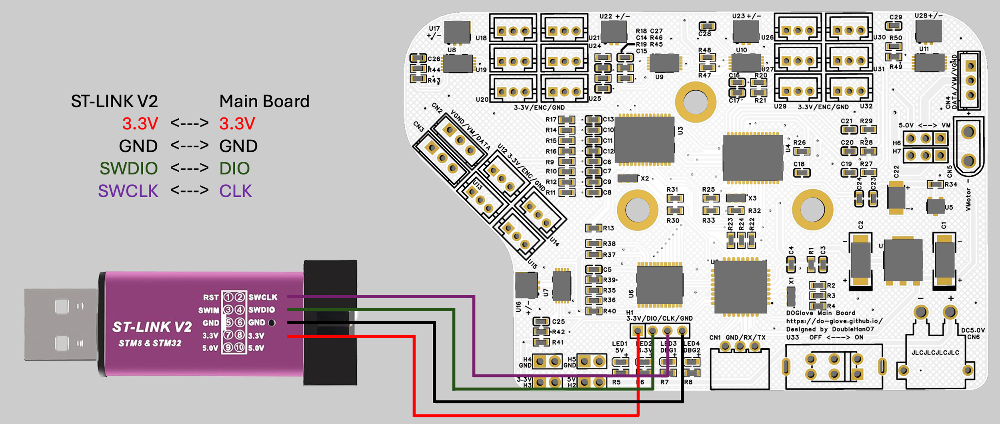

.. _flash-firmware:

Flash the Firmware
==================

First, follow the image below to correctly connect the main board to the ST-Link V2.

Next, download the latest firmware:

- :download:`DOGlove firmware <https://github.com/doublehan07/DOGlove_Firmware/releases/download/v1.0/DOGlove.hex>`

Then you need a tool to flash the firmware into the STM32 MCU (Microcontroller).

For Ubuntu, we suggest `openocd <https://openocd.org/pages/getting-openocd.html>`_.

.. note::

   Our whole system is verified under Ubuntu 20.04. 
   
   For macOS, you can also use `openocd` by running ``brew install open-ocd``. 
   
   For Windows, consider using the `STM32Programmer <https://www.st.com/en/development-tools/stm32cubeprog.html>`_.

To install openocd, simply type this command:

.. code-block:: bash

   sudo apt-get install openocd

Then change directory to the firmware location:

.. code-block:: bash

   cd <YOUR_FIRMWARE_LOCATION>
   openocd -f interface/stlink-v2.cfg -f target/stm32f0x.cfg -c "program DOGlove.hex verify reset exit"

If everything goes well, you might see the following message:

.. code-block:: text

   flash verify OK
