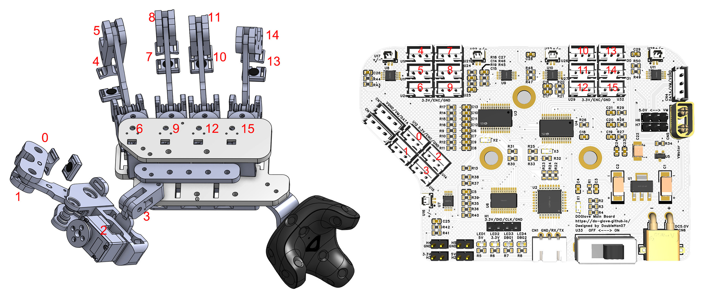
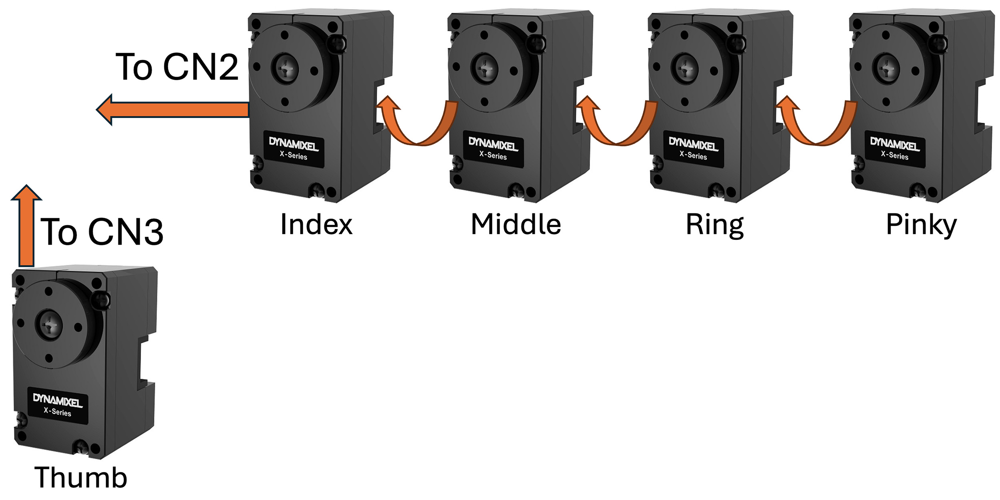
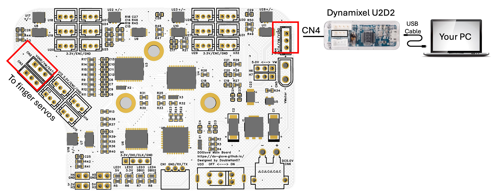
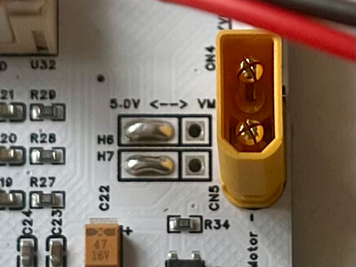
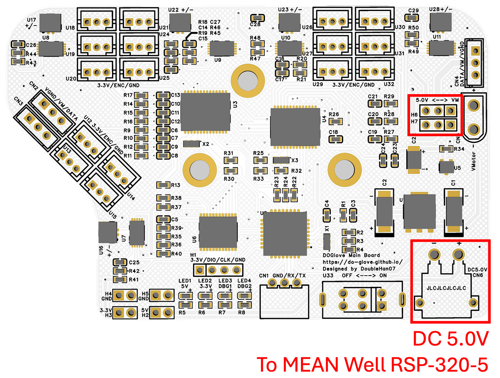
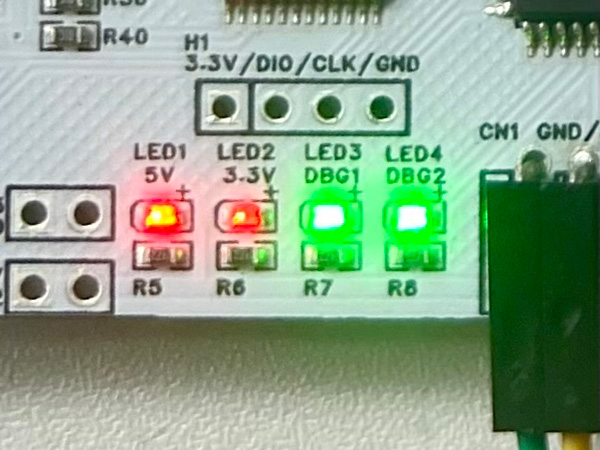

.. _make_it_move:

================
Make It Move
================

1. Wire Connection
====================

**Encoder Connection**
-------------------------

Follow the image tutorial below to connect the joint encoders to the corresponding board connector.

.. note::
   You should strictly follow the number allocation in the image, otherwise the joint mapping will be incorrect.

**Servo Connection**
-----------------------

The Dynamixel servo supports chain connection.

Simply connect the index, middle, ring, and pinky servos together, then use one cable to connect the four servos to **CN2** on the main board. Connect the thumb servo to **CN3** on the main board.

Then connect Dynamixel U2D2 to **CN4**.

**Power Tree**
-----------------

The board is powered by DC 5.0V.

If you use the recommended power supply (`MEAN Well RSP-320-5V Power Supply <../chapters/getting_started.html>`_), simply **short the left two pins of H6 and H7**. 

This way, both the digital circuit and servos are powered from a single power input CN6. CN6 is an XT30 Male connector.

.. note::
   H6 and H7 select the power source for the servos. 

   Short the **left two pins** to power the servos from CN6 (same source as the MCU).
   
   Short the **right two pins** to power the servos independently from CN5.

This design allows you to separate the power supply for the servos and MCU if needed (e.g., when your power supply cannot provide sufficient current for servo stall current).

2. Status LED Check
======================

Hurray! It's time to power on the whole system!

Turn on the switch **U33** on the main board. If everything is functioning properly, all the status LEDs should light up.

